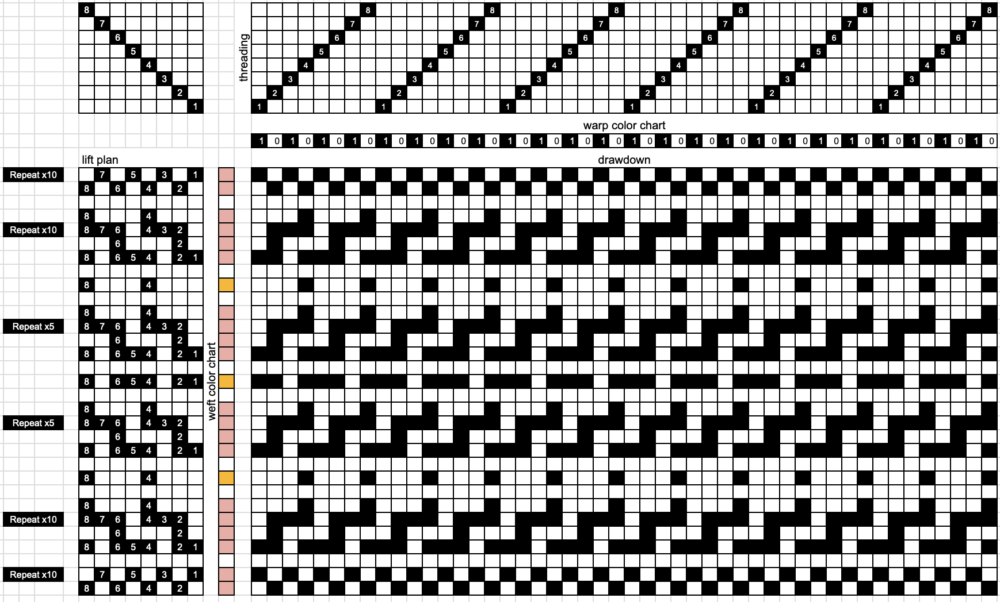
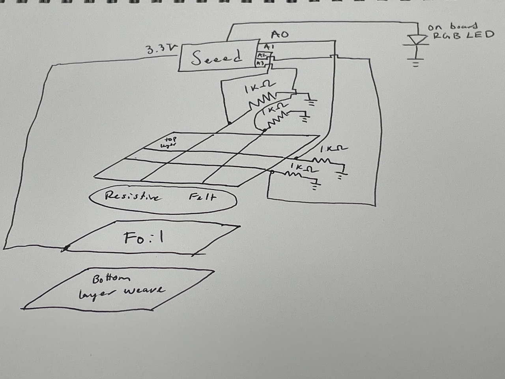

# Experimental Textiles
Matt Nicholson -- CU Boulder, Fall 2023

## Description of this project

This project is a woven resistive touch sensor that can track from where and how hard the swatch was pressed. The working principle for this swatch is inspired by other resistive sensors made in textiles [1-2], and the actual form is inspired by resistive touch screens [3]. 
This swatch consists of a header of tabby before splitting off into several layers of different materials. The innermost layer is a conductive felt that sits on a layer of aluminum foil, with duct tape around the edges for insulation. This assembly sits within a woven pocket that has a lattice of conductive thread on the top layer that connects to a set of 1K Ohm resistors, and an integrated wire on the bottom layer that connects to power. Each wire of the lattice is then connected to an analog to digital converter pin on the microcontroller with an alligator clip, and the signal from each is used to power a single channel of an onboard RGB LED. With this arrangement, both location of a press and force exerted on the swatch can be observed. Microcontroller code is included in this repo.

[1] Donut Pot. (n.d.). https://www.kobakant.at/DIY/?p=8112 

[2] Pin Pot. (n.d.). https://www.kobakant.at/DIY/?p=7764 

[3] Downs, R. (2005). Using resistive touch screens for human/machine interface. Data Acquisition.

## Final Working Product

### Nothing Happens When Not Pressed

  
  

## Draft and Schematic

The weave consists of a section of tabby, and two layer section, and a final section of tabby. Conductive thread is both integrated as supplemental weft and is sewn the warp direction.

## Materials and Tools

### Materials
- 1 Seeed Studio XIAO RP2040 microcontroller, with USB-C cable
- Yarn with a similar weight to the warp (fine or light)
- Conductive Thread
- Conductive Felt
- 18” Braided Core Wire
- 4 x 1K Ohm Resistors
- 2 Alligator Clips
- 8 Crimp beads
- Aluminum Foil
- Duct Tape (to insulate the edges of the foil layer)

### Tools
- 8 shaft loom (could also use 4 shaft loom)
- 1 stick shuttle
- Sewing needle
- Wire strippers

